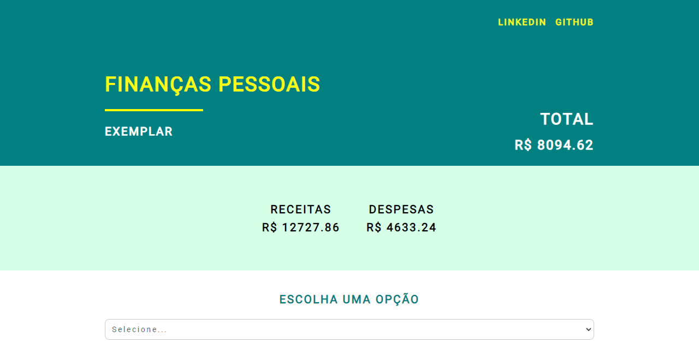
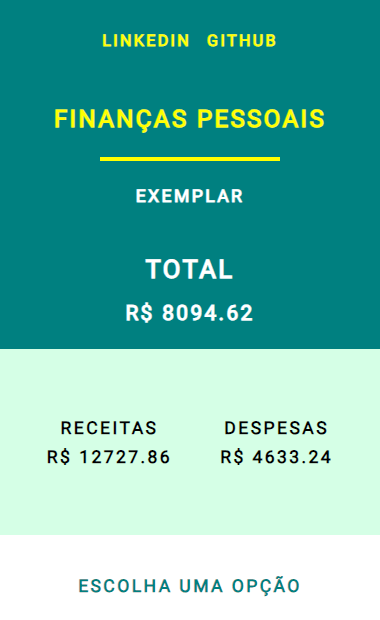

# **Finanças Pessoais**

<!--  -->

Acesse o Projeto: [Finanças Pessoais React](https://reactjs-finances.vercel.app/)

## Sobre o projeto

Um projeto foi desenvolvido com React e TypeScript, utilizando a Context API para gerenciar o estado da aplicação. Uma API Json fictícia foi integrada para fornecer dados dinâmicos. O layout responsivo foi implementado com flexbox para garantir uma experiência consistente em diferentes dispositivos.

O objetivo é trabalhar com React e TypeScript, utilizando a Context API para gerenciar o estado da aplicação e integrar uma API Rest para obter dados dinâmicos.

#### About the project

A project was developed with React and TypeScript, using the Context API to manage the application state. A dummy Json API has been integrated to provide dynamic data. The responsive layout was implemented with flexbox to ensure a consistent experience across different devices.

The objective is to work with React and TypeScript, using the Context API to manage the application state and integrate a Rest API to obtain dynamic data.

## Mobile Layout

## Tecnologias Utilizadas (Technologies Used)
* HTML5
* CSS3
* Flexbox
* JavaScript
* Typescript
* API JSON Fictícia
* Context API
* React Js Vite

## Instalação (Installation)

##### Instalar Dependências (Install Dependencies)
<pre><code>npm install</code></pre>

##### Executar Aplicação (Run Application)
<pre><code>npm run dev</code></pre>

## Autor (Author)

#### **Katarine Albuquerque**

 &nbsp; 
